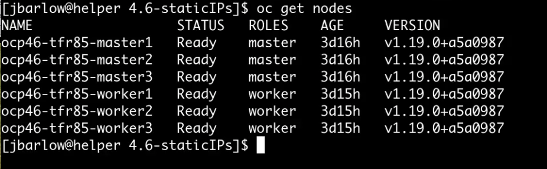
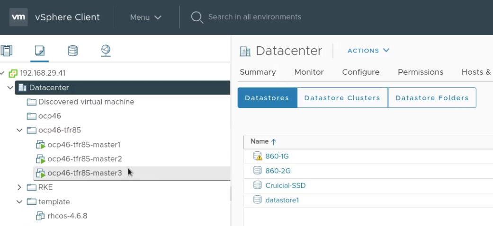
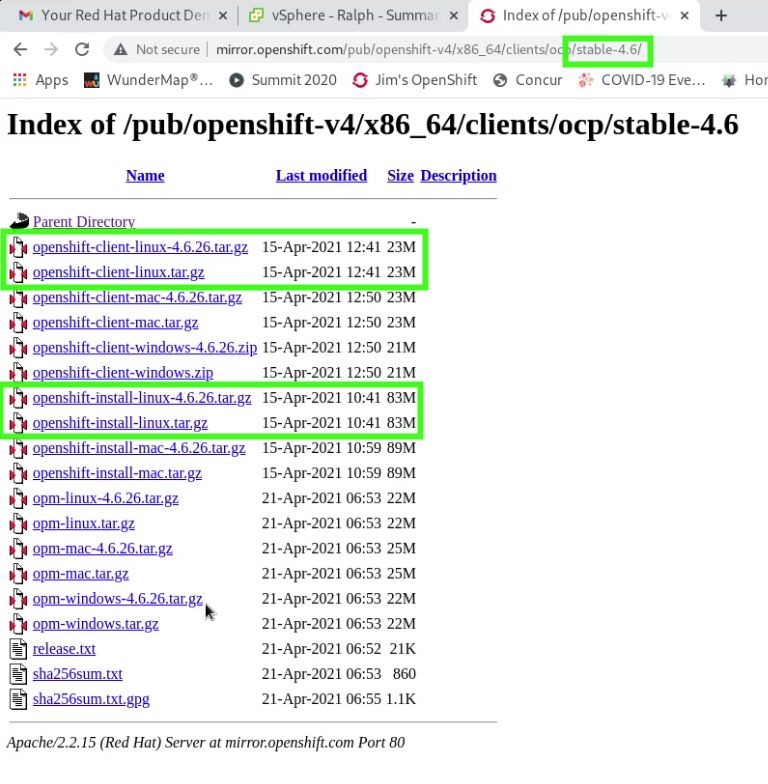
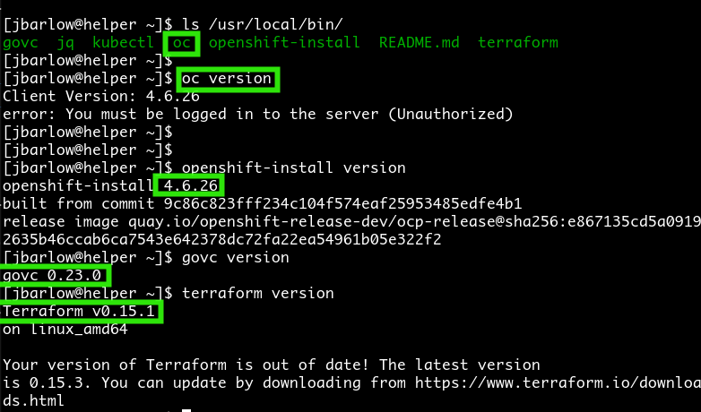

# Provisioning UPI with Static or Dynamic IPs.
## The forked repository I'm using Tosin Akinosho's fork of Alex Kretschmar's
Project / repository : https://github.com/ironicbadger/ocp4 
A lot of thought has gone into this deployer by Alex, and Tosin has segmented it for versions of OpenShift to allow for more tweaking.
I've forked Tosin's environment:
git clone https://github.com/tosin2013/ocp4
Note: That I have not replicated the notes here on where to get the tools. 
## Modifications for your environment
### Here is what I've modifified from Tosin's starting point:
Firstly, from the root of the repository, here are my "diffs":

```
[jbarlow@helper ocp4]$ git diff -U1
diff --git a/clusters/4.6-staticIPs/main.tf b/clusters/4.6-staticIPs/main.tf
index 2071095..07254ac 100644
--- a/clusters/4.6-staticIPs/main.tf
+++ b/clusters/4.6-staticIPs/main.tf
@@ -5,3 +5,3 @@ module "master" {
   folder    = "${var.cluster_slug}"
-  datastore = data.vsphere_datastore.changeme.id
+  datastore = data.vsphere_datastore.nvme500.id
   disk_size = 120
@@ -33,3 +33,3 @@ module "worker" {
   folder    = "${var.cluster_slug}"
-  datastore = data.vsphere_datastore.changeme.id
+  datastore = data.vsphere_datastore.nvme500.id
   disk_size = 120
@@ -61,3 +61,3 @@ module "bootstrap" {
   folder    = "${var.cluster_slug}"
-  datastore = data.vsphere_datastore.changeme.id
+  datastore = data.vsphere_datastore.nvme500.id
   disk_size = 120
@@ -87,3 +87,3 @@ module "bootstrap" {
 #  source = "../../modules/lb"
-#  ssh_key_file  = [file("~/.ssh/changeme.pub")]
+#  ssh_key_file  = [file("~/.ssh/nvme500.pub")]
 # lb_ip_address = var.loadbalancer_ip
@@ -101,3 +101,3 @@ module "bootstrap" {
 #  folder    = "${var.cluster_slug}"
-#  datastore = data.vsphere_datastore.changeme.id
+#  datastore = data.vsphere_datastore.nvme500.id
 #  disk_size = 16
diff --git a/clusters/4.6-staticIPs/terraform.tfvars b/clusters/4.6-staticIPs/terraform.tfvars
index 63b389f..75ba02c 100644
--- a/clusters/4.6-staticIPs/terraform.tfvars
+++ b/clusters/4.6-staticIPs/terraform.tfvars
@@ -1,13 +1,14 @@
 ## Node IPs
-loadbalancer_ip = "192.168.4.160"  ## This can be an external LB ip address 
-bootstrap_ip = "192.168.4.169"
-master_ips = ["192.168.4.161", "192.168.4.162", "192.168.4.163"]
-worker_ips = ["192.168.4.164", "192.168.4.165", "192.168.4.166"]
+loadbalancer_ip = "192.168.29.49"  ## This can be an external LB ip address 
+bootstrap_ip = "192.168.29.180"
+master_ips = ["192.168.29.181", "192.168.29.182", "192.168.29.183"]
+worker_ips = ["192.168.29.191", "192.168.29.192", "192.168.29.193"]
 
 ## DNS
-dns_addresses = ["192.168.1.254"]
-gateway = "192.168.1.254"
-machine_cidr = "192.168.4.0/16"
-cluster_domain = "ocp4.ktz.lan"
-netmask ="255.255.0.0"
+# dns_addresses = ["192.168.29.49"]
+dns_address = "192.168.29.49"
+gateway = "192.168.29.1"
+machine_cidr = "192.168.29.0/24"
+cluster_domain = "ocp46.jimbarlow.com"
+netmask ="255.255.255.0"
 
@@ -17,2 +18,2 @@ bootstrap_ignition_path = "../../openshift/bootstrap.ign"
 master_ignition_path = "../../openshift/master.ign"
-worker_ignition_path = "../../openshift/worker.ign"
\ No newline at end of file
+worker_ignition_path = "../../openshift/worker.ign"
diff --git a/clusters/4.6-staticIPs/variables.tf b/clusters/4.6-staticIPs/variables.tf
index 0fdb9a4..74797f6 100644
--- a/clusters/4.6-staticIPs/variables.tf
+++ b/clusters/4.6-staticIPs/variables.tf
@@ -9,3 +9,3 @@ variable "cluster_slug" {
   type    = string
-  default = "ocp46"
+  default = "ocp46-bxbsn"
 }
@@ -15,3 +15,3 @@ variable "domain_name" {
   type    = string
-  default = "ktz.lan"
+  default = "jimbarlow.com"
 }
@@ -44,3 +44,3 @@ variable "ignition" {
 data "vsphere_virtual_machine" "template" {
-  name          = "rhcos-4.6.1"
+  name          = "rhcos-4.6.8"
   datacenter_id = data.vsphere_datacenter.dc.id
@@ -77,3 +77,3 @@ data "vsphere_network" "network" {
 data "vsphere_datastore" "nvme500" {
-  name          = "nvme500"
+  name          = "860-2G"
   datacenter_id = data.vsphere_datacenter.dc.id
diff --git a/clusters/4.7-staticIPs/main.tf b/clusters/4.7-staticIPs/main.tf
index 625fd32..2071095 100644
--- a/clusters/4.7-staticIPs/main.tf
+++ b/clusters/4.7-staticIPs/main.tf
@@ -5,3 +5,3 @@ module "master" {
   folder    = "${var.cluster_slug}"
-  datastore = data.vsphere_datastore.datastore_name.id
+  datastore = data.vsphere_datastore.changeme.id
   disk_size = 120
@@ -33,3 +33,3 @@ module "worker" {
   folder    = "${var.cluster_slug}"
-  datastore = data.vsphere_datastore.datastore_name.id
+  datastore = data.vsphere_datastore.changeme.id
   disk_size = 120
@@ -61,3 +61,3 @@ module "bootstrap" {
   folder    = "${var.cluster_slug}"
-  datastore = data.vsphere_datastore.datastore_name.id
+  datastore = data.vsphere_datastore.changeme.id
   disk_size = 120
@@ -101,3 +101,3 @@ module "bootstrap" {
 #  folder    = "${var.cluster_slug}"
-#  datastore = data.vsphere_datastore.datastore_name.id
+#  datastore = data.vsphere_datastore.changeme.id
 #  disk_size = 16
diff --git a/clusters/4.7-staticIPs/terraform.tfvars b/clusters/4.7-staticIPs/terraform.tfvars
index 63b389f..583aa4b 100644
--- a/clusters/4.7-staticIPs/terraform.tfvars
+++ b/clusters/4.7-staticIPs/terraform.tfvars
@@ -1,13 +1,16 @@
 ## Node IPs
-loadbalancer_ip = "192.168.4.160"  ## This can be an external LB ip address 
-bootstrap_ip = "192.168.4.169"
-master_ips = ["192.168.4.161", "192.168.4.162", "192.168.4.163"]
-worker_ips = ["192.168.4.164", "192.168.4.165", "192.168.4.166"]
+loadbalancer_ip = "192.168.29.49"  ## This can be an external LB ip address 
+bootstrap_ip = "192.168.29.180"
+master_ips = ["192.168.29.181", "192.168.29.182", "192.168.29.183"]
+worker_ips = ["192.168.29.191", "192.168.29.192", "192.168.29.193"]
 
 ## DNS
-dns_addresses = ["192.168.1.254"]
-gateway = "192.168.1.254"
-machine_cidr = "192.168.4.0/16"
-cluster_domain = "ocp4.ktz.lan"
-netmask ="255.255.0.0"
+rhcos_template = "rhcos-4.6.8"
+cluster_slug = "ocp46"
+local_dns = ["192.168.29.49"]
+public_dns = ["192.168.29.1"]
+gateway = "192.168.29.1"
+machine_cidr = "192.168.29.0/24"
+cluster_domain = "jimbarlow.com"
+netmask ="255.255.255.0"
 
@@ -17,2 +20,2 @@ bootstrap_ignition_path = "../../openshift/bootstrap.ign"
 master_ignition_path = "../../openshift/master.ign"
-worker_ignition_path = "../../openshift/worker.ign"
\ No newline at end of file
+worker_ignition_path = "../../openshift/worker.ign"
diff --git a/clusters/4.7-staticIPs/variables.tf b/clusters/4.7-staticIPs/variables.tf
index 8fc6db1..1a15549 100644
--- a/clusters/4.7-staticIPs/variables.tf
+++ b/clusters/4.7-staticIPs/variables.tf
@@ -15,3 +15,3 @@ variable "domain_name" {
   type    = string
-  default = "ktz.lan"
+  default = "jimbarlow.com"
 }
diff --git a/makefile b/makefile
index 3da0b77..2ba5a62 100644
--- a/makefile
+++ b/makefile
@@ -1,4 +1,2 @@
 tfinit:
-       cd clusters/4.5; terraform init
-       cd clusters/4.5-staticIPs; terraform init
        cd clusters/4.6-staticIPs; terraform init
@@ -9,3 +7,3 @@ create:
        cd openshift/; ./generate-configs.sh
-       cd clusters/4.7-staticIPs; terraform apply -auto-approve
+       cd clusters/4.6-staticIPs; terraform apply -auto-approve
 
@@ -13,6 +11,9 @@ static45:
        ./generate-configs.sh
-       cd clusters/4.5-staticIPs; terraform apply -auto-approve
+       cd clusters/4.6-staticIPs; terraform apply -auto-approve
+static46:
+       ./generate-configs.sh
+       cd clusters/4.6-staticIPs; terraform apply -auto-approve
 
-nuke45:
-       cd clusters/4.6; terraform destroy
+nukestatic46:
+       cd clusters/4.6-staticIPs; terraform destroy
 
```

## Tearing down a Terraform provisioned environment

In this example, I have a provisioned environmnent, that I provisioned from a host machine named "helper"
```
[jbarlow@helper tform]$oc whoami
system:admin
[jbarlow@helper tform]$oc whoami --show-console
https://console-openshift-console.aps.ocp46.jimbarlow.com
```

Note that I have the cluster-admin role, and by checking the console URL, which includes the cluster name and the domain name,  I know the cluster is the one I want to tear down.

My cluster was provisioned using the a version number in the cluster directory

```
cd ~/tform/ocp4/clusters/4.6-staticIPs
```


Time to initialize the modules:

``` 
terraform init
```
Followed by a destroy command:
```
terraform destroy
```
You will be required to type "yes" to the terraform prompt to continue. After that the nodes will rapidly disappear from the view in the vSphere Client. In this screenshot, the worker nodes have already been cleared:



Once the nodes are gone, you are welcomed to delete the folder in which they were deployed. In my case this was `ocp46-tfr85`

## Installation of a New or Replacement Cluster



Go to the OpenShift mirror as per above, and you may want the stable branch. Note `stable-4.6` in the URL. Then, select the appropriate installer. Grab the install tool appropriate for your "bastion host" from which you wish to install, as well as the openshift-client. In my case, of course, it is Linux!

Unzip the files you obtain from these archives, and I like to put them into /usr/local/bin/ so that they are in my execution path.



Everything is ready, and note the required Terraform >= 13.1

